# 📚 Learnfinity Documentation

Welcome to the **Learnfinity CI/CD System** documentation! This directory contains comprehensive guides for setting up and using the automated Moodle plugin testing and deployment pipeline.

## 📖 Documentation Overview

### 🚀 [Quick Start Guide](Quick-Start-Guide.md)
**Perfect for**: New users who want to get up and running quickly  
**Time required**: ~15 minutes  
**What you'll get**: Working CI/CD pipeline with automatic plugin testing and deployment

**Covers:**
- ⚡ Fast server setup
- 🔑 GitHub secrets configuration  
- 🧪 Testing your first deployment
- 🔄 Daily usage workflow

### 📋 [Complete CI/CD Documentation](CI-CD-Documentation.md)  
**Perfect for**: Developers, system administrators, and advanced users  
**Time required**: ~45 minutes to read, comprehensive reference  
**What you'll get**: Deep understanding of the entire CI/CD system

**Covers:**
- 🏗️ Workflow architecture and design
- 🧪 Detailed plugin testing process
- 🚀 Advanced deployment configurations
- 🔧 Comprehensive troubleshooting
- 🏆 Best practices and security guidelines
- 📊 Monitoring and maintenance

### 📝 [YAML and GitHub Actions Guide](YAML-and-GitHub-Actions-Guide.md)
**Perfect for**: Beginners who are new to YAML and GitHub Actions  
**Time required**: ~30 minutes to read and understand  
**What you'll get**: Complete understanding of how .yml files work and GitHub Actions

**Covers:**
- 🤔 What is YAML and why use it
- 📚 YAML syntax basics with examples
- ⚙️ How GitHub Actions uses YAML files
- 📖 Explanation of your actual workflow files
- 🎯 Common patterns and practical examples
- 🐛 Troubleshooting YAML errors

## 🎯 Choose Your Path

| Your Situation | Recommended Reading |
|----------------|-------------------|
| **New to the project** | Start with [Quick Start Guide](Quick-Start-Guide.md) |
| **New to YAML/GitHub Actions** | Read [YAML and GitHub Actions Guide](YAML-and-GitHub-Actions-Guide.md) |
| **Want to understand how it works** | Read [Complete Documentation](CI-CD-Documentation.md) |
| **Having issues** | Check troubleshooting in [Complete Documentation](CI-CD-Documentation.md) |
| **Want to contribute** | Read both guides, focus on Best Practices section |
| **Need technical details** | See [Workflow Technical Reference](Workflow-Technical-Reference.md) |

## 🏗️ System Architecture Overview

```mermaid
graph TB
    subgraph "Developer"
        A[Write Plugin Code]
        B[Commit & Push]
    end
    
    subgraph "GitHub Actions"
        C[Plugin CI Tests]
        D{Tests Pass?}
        E[Deploy to Server]
    end
    
    subgraph "Production Server"
        F[Moodle Installation]
        G[Plugin Available]
    end
    
    A --> B
    B --> C
    C --> D
    D -->|✅ Yes| E
    D -->|❌ No| H[Deployment Blocked]
    E --> F
    F --> G
```



## ⚡ Key Features

- **🔍 Automatic Plugin Detection**: No manual configuration needed
- **🧪 Multi-Version Testing**: Tests across PHP 8.1-8.3 and multiple Moodle versions  
- **🚀 Smart Deployment**: Only deploys after tests pass
- **🛡️ Security First**: SSH-based deployment with proper permissions
- **📊 Comprehensive Testing**: Includes code standards, PHPUnit, and Behat tests
- **🔄 Zero-Downtime Updates**: Backup and rollback capabilities

## 🚀 What You'll Build

By following these guides, you'll have:

1. **Automated Testing Pipeline**
   - PHP syntax checking
   - Moodle coding standards validation
   - PHPUnit test execution
   - Behat functional testing

2. **Automated Deployment System**  
   - First-time Moodle installation capability
   - Plugin update deployments
   - Automatic permission management
   - Built-in verification and rollback

3. **Development Workflow**
   - Push code → Tests run → Deployment happens
   - Manual trigger options for testing/deployment
   - Emergency deployment bypass capabilities

## 📊 Status Badges

Add these to your main README to show build status:

```markdown


```

## 🆘 Quick Help

### Common Issues
- **SSH Connection Failed**: Check [SSH troubleshooting](CI-CD-Documentation.md#ssh-connection-failed)
- **Permission Denied**: See [permission fix guide](Quick-Start-Guide.md#problem-permission-denied)
- **Plugin Not Detected**: Review [plugin structure requirements](CI-CD-Documentation.md#plugin-not-detected)

### Getting Support
- 📖 **Documentation**: Start with these guides
- 🐛 **Issues**: Use GitHub Issues for bugs and feature requests  
- 💬 **Community**: Moodle Developer Forums for general Moodle questions

## 🤝 Contributing to Documentation

Help improve these guides:

1. **Found an error?** Open an issue or submit a PR
2. **Missing information?** Let us know what's unclear
3. **Want to add examples?** Contributions welcome!

### Documentation Standards
- Use clear, step-by-step instructions
- Include code examples and expected outputs
- Add troubleshooting for common issues
- Keep language simple and accessible

## 📈 Roadmap

Future documentation improvements:

- [ ] Video tutorials for visual learners
- [ ] Docker deployment guide
- [ ] Multi-environment setup (dev/staging/prod)
- [ ] Integration with other CI/CD tools
- [ ] Advanced plugin development patterns

## 📄 File Structure

```
docs/
├── README.md                           # This overview file
├── Quick-Start-Guide.md                # 15-minute setup guide  
├── CI-CD-Documentation.md              # Comprehensive documentation
├── YAML-and-GitHub-Actions-Guide.md    # YAML/GitHub Actions tutorial
├── Workflow-Technical-Reference.md     # Technical workflow details
├── examples/                           # Example configurations (coming soon)
└── troubleshooting/                   # Detailed troubleshooting guides (coming soon)
```

---

## 🎉 Ready to Start?

1. **New to YAML/GitHub Actions?** → [📝 YAML and GitHub Actions Guide](YAML-and-GitHub-Actions-Guide.md)
2. **New User?** → [🚀 Quick Start Guide](Quick-Start-Guide.md)
3. **Want Full Details?** → [📋 Complete Documentation](CI-CD-Documentation.md)
4. **Need Technical Details?** → [🔧 Workflow Technical Reference](Workflow-Technical-Reference.md)
5. **Need Help?** → Check troubleshooting sections in any guide

**Happy Coding! 🚀**

---

*Last Updated: January 2025 | Version 1.0* 