# 🔧 Workflow Technical Reference

This document provides detailed technical information about the GitHub Actions workflows used in the Learnfinity CI/CD system. Use this reference when you need to understand or modify the workflow configurations.

## 📋 Table of Contents

1. [Workflow Files Overview](#workflow-files-overview)
2. [Plugin CI Workflow (learnfinity-ci.yml)](#plugin-ci-workflow)
3. [Deployment Workflow (deploy.yml)](#deployment-workflow)
4. [Customization Guide](#customization-guide)
5. [Advanced Configurations](#advanced-configurations)
6. [Workflow Dependencies](#workflow-dependencies)

---

## 📁 Workflow Files Overview

```
.github/workflows/
├── learnfinity-ci.yml          # Plugin testing workflow
└── deploy.yml                  # Deployment workflow
```

### Workflow Relationship

```mermaid
graph LR
    A[Push to master] --> B[learnfinity-ci.yml]
    B --> C{Tests Pass?}
    C -->|✅ Yes| D[deploy.yml]
    C -->|❌ No| E[Stop - No Deployment]
    D --> F[Server Deployment]
```


---

## 🧪 Plugin CI Workflow (learnfinity-ci.yml)

### Overview
Tests Moodle plugins automatically across multiple PHP and Moodle versions with comprehensive quality checks.

### Trigger Configuration

```yaml
on: 
  push:
    branches: [master]                    # Auto-trigger on master push
  pull_request:
    branches: [master]                    # Auto-trigger on PR to master
  workflow_dispatch:                      # Allow manual triggers
    inputs:
      plugin_path:
        description: 'Plugin path to test (e.g., local/myplugin). Leave empty to auto-detect.'
        required: false
        type: string
```

**Key Points:**
- **Automatic triggers** ensure code quality on every change
- **Manual triggers** allow testing specific plugins
- **Pull request triggers** enable code review workflow

### Job Configuration

```yaml
jobs:
  test:
    runs-on: ubuntu-22.04                 # Stable Ubuntu LTS
    
    env:
      PLUGIN_PATH: ${{ github.event.inputs.plugin_path || '' }}
```

**Environment Setup:**
- **Ubuntu 22.04**: Provides stable, well-supported environment
- **Dynamic plugin path**: Allows both auto-detection and manual specification

### Service Configuration

```yaml
services:
  mysql:
    image: mysql:8.4                      # Latest MySQL 8.x
    env:
      MYSQL_ROOT_PASSWORD: root
      MYSQL_DATABASE: test
      MYSQL_USER: test  
      MYSQL_PASSWORD: test
    ports:
      - 3306:3306
    options: --health-cmd="mysqladmin ping --silent" --health-interval=10s --health-timeout=5s --health-retries=3
```

**Database Features:**
- **Health checks** ensure database is ready before tests start
- **Standardized credentials** work across all test matrices
- **Port mapping** allows easy database access from tests

### Test Matrix Strategy

```yaml
strategy:
  fail-fast: false                        # Continue testing other combinations on failure
  matrix:
    include:
      # Primary target - Latest versions
      - php: '8.3'
        moodle-branch: 'MOODLE_405_STABLE'
        database: mysqli
        extensions: mbstring, xml, intl, gd, curl, zip, mysqli
        primary: true
        
      # Compatibility testing - Older versions  
      - php: '8.2'
        moodle-branch: 'MOODLE_404_STABLE'
        database: mysqli
        extensions: mbstring, xml, intl, gd, curl, zip, mysqli
        primary: false
```

**Matrix Benefits:**
- **fail-fast: false** prevents one failure from stopping all tests
- **Primary flag** identifies the main testing target
- **Extension specification** ensures all required PHP modules are available

### Dynamic Plugin Detection

```yaml
- name: Auto-detect Plugin Path
  id: plugin-detection
  run: |
    if [ -n "${{ env.PLUGIN_PATH }}" ]; then
      echo "🎯 Using manually specified plugin: ${{ env.PLUGIN_PATH }}"
      echo "DETECTED_PLUGIN_PATH=${{ env.PLUGIN_PATH }}" >> $GITHUB_ENV
    else
      echo "🔍 Auto-detecting plugins..."
      
      # Check local/ directory
      if [ -d "local" ]; then
        for dir in local/*/; do
          if [ -f "${dir}version.php" ] && [ -f "${dir}lang/en/"*".php" 2>/dev/null ]; then
            PLUGIN_DIR="${dir%/}"
            echo "✅ Found local plugin: $PLUGIN_DIR"
            PLUGIN_DIRS="$PLUGIN_DIRS $PLUGIN_DIR"
          fi
        done
      fi
      
      # ... additional detection logic for mod/ and blocks/
    fi
```

**Detection Algorithm:**
1. **Manual override** takes precedence if specified
2. **Directory scanning** looks for plugin indicators:
   - `version.php` file (required for all Moodle plugins)
   - Language files in `lang/en/` directory
3. **Smart filtering** excludes built-in Moodle components
4. **Environment export** makes plugin path available to all subsequent steps

### Test Suite Execution

```yaml
- name: PHP Lint
  if: ${{ !cancelled() }}                # Run even if previous step failed
  run: moodle-plugin-ci phplint ./${DETECTED_PLUGIN_PATH}

- name: Moodle Code Checker
  if: ${{ !cancelled() }}
  run: moodle-plugin-ci phpcs --max-warnings 0 ./${DETECTED_PLUGIN_PATH}
```

**Test Features:**
- **Conditional execution** using `!cancelled()` ensures tests run even if others fail
- **Zero tolerance** for warnings ensures high code quality
- **Dynamic plugin path** allows testing any detected plugin

### Node.js Version Management

```yaml
- name: Fix Node.js version after Moodle installation
  run: |
    export NVM_DIR="$HOME/.nvm"
    [ -s "$NVM_DIR/nvm.sh" ] && \. "$NVM_DIR/nvm.sh"
    
    echo "20.11.0" > .nvmrc
    nvm install 20.11.0
    nvm use 20.11.0
    node --version
```

**Why This is Needed:**
- **Moodle plugin CI** sometimes installs different Node.js versions
- **Grunt tasks** require specific Node.js versions for compatibility
- **Version pinning** ensures consistent behavior across runs

---

## 🚀 Deployment Workflow (deploy.yml)

### Overview
Handles both first-time Moodle installations and plugin updates with automatic verification and rollback capabilities.

### Advanced Trigger System

```yaml
on:
  # Deploy after CI tests pass
  workflow_run:
    workflows: ["Learnfinity Plugin CI"]
    types: [completed]
    branches: [master]
  
  # Allow manual deployment
  workflow_dispatch:
  
  # Emergency direct deployment (bypass CI)
  push:
    branches: [master]
    paths: ['.github/workflows/deploy.yml']
```

**Trigger Types:**
1. **workflow_run**: Automatic trigger after CI completion
2. **workflow_dispatch**: Manual deployment control
3. **push with path filter**: Emergency deployment for workflow changes

### Smart Deployment Logic

```yaml
if: >
  github.event_name == 'workflow_dispatch' ||
  (github.event_name == 'push' && contains(github.event.head_commit.message, '.github/workflows/deploy.yml')) ||
  (github.event_name == 'workflow_run' && github.event.workflow_run.conclusion == 'success')
```

**Condition Breakdown:**
- **Manual trigger**: Always allowed for admin control
- **Emergency push**: Only if workflow files are modified
- **CI trigger**: Only if CI tests passed successfully

### Secret Validation

```yaml
- name: Check Required Secrets
  id: check-secrets
  run: |
    echo "🔍 Checking required secrets..."
    
    if [ "${{ secrets.FIRST_TIME_DEPLOYMENT }}" = "true" ]; then
      echo "deployment_type=first_time" >> $GITHUB_OUTPUT
      
      if [ -z "${{ secrets.SERVER_BASE_PATH }}" ]; then
        echo "❌ SERVER_BASE_PATH secret is missing!"
        exit 1
      fi
      # ... additional secret checks
    fi
```

**Validation Features:**
- **Dynamic secret requirements** based on deployment type
- **Early failure** prevents deployment with missing configuration
- **Output variables** control subsequent step execution

### First-Time Deployment Process

```yaml
- name: First-time Moodle Deployment
  if: steps.check-secrets.outputs.deployment_type == 'first_time'
  uses: appleboy/ssh-action@v1.0.3
  with:
    host: ${{ secrets.SERVER_HOST }}
    username: ${{ secrets.SERVER_USERNAME }}
    key: ${{ secrets.SERVER_SSH_KEY }}
    port: ${{ secrets.SERVER_PORT || 22 }}
    script: |
      echo "🚀 Starting FIRST-TIME Moodle deployment..."
      
      # Create base directory
      if [ ! -d "${{ secrets.SERVER_BASE_PATH }}" ]; then
        mkdir -p ${{ secrets.SERVER_BASE_PATH }}
      fi
      
      cd ${{ secrets.SERVER_BASE_PATH }}
      
      # Backup existing installation
      if [ -d "moodle" ]; then
        cp -r moodle moodle.backup.$(date +%Y%m%d_%H%M%S)
      fi
      
      # Clone fresh installation
      git clone -b master https://github.com/${{ github.repository }}.git moodle
```

**Deployment Steps:**
1. **Directory creation** with error handling
2. **Automatic backup** of existing installations
3. **Fresh clone** from master branch
4. **Permission setup** with fallback handling
5. **Configuration generation** from templates

### Plugin Update Deployment

```yaml
- name: Plugin Update Deployment
  if: steps.check-secrets.outputs.deployment_type == 'plugin_update'
  uses: appleboy/ssh-action@v1.0.3
  with:
    script: |
      echo "🔧 Starting PLUGIN UPDATE deployment..."
      
      cd ${{ secrets.MOODLE_PATH }}
      
      # Create plugin backup
      if [ -d "local/test_plugin" ]; then
        cp -r local/test_plugin local/test_plugin.backup.$(date +%Y%m%d_%H%M%S)
      fi
      
      # Update code
      git pull origin master
      
      # Run Moodle upgrade
      php admin/cli/upgrade.php --non-interactive
```

**Update Process:**
1. **Incremental backup** of only the plugin
2. **Git synchronization** with remote repository
3. **Cache clearing** to ensure changes are applied
4. **Database upgrade** with non-interactive mode
5. **Verification** of plugin integrity

### Verification System

```yaml
- name: Verify First-time Deployment
  if: steps.check-secrets.outputs.deployment_type == 'first_time'
  script: |
    cd ${{ secrets.SERVER_BASE_PATH }}/moodle
    
    if [ -f "version.php" ]; then
      echo "✅ Moodle installation exists"
    else
      echo "❌ Moodle installation not found"
      exit 1
    fi
    
    if [ -d "../moodledata" ]; then
      echo "✅ moodledata directory exists"
    else
      echo "❌ moodledata directory not found"
      exit 1
    fi
```

**Verification Checks:**
- **File integrity**: Ensures all required files are present
- **Directory structure**: Validates proper Moodle layout
- **Permission verification**: Checks file accessibility
- **Plugin validation**: Confirms plugin installation

---

## 🔧 Customization Guide

### Adding New Test Steps

To add a custom test step to the CI workflow:

```yaml
- name: Custom Plugin Test
  if: ${{ !cancelled() }}
  run: |
    echo "🧪 Running custom tests for ${DETECTED_PLUGIN_PATH}"
    
    # Your custom test commands here
    cd ./${DETECTED_PLUGIN_PATH}
    
    # Example: Custom validation
    php -f validate_plugin.php
    
    # Example: Custom linting
    ./custom_linter.sh
```

**Best Practices:**
- Use `!cancelled()` condition to run even if previous steps failed
- Include the plugin path variable for dynamic testing
- Add descriptive echo statements for debugging
- Exit with non-zero code on test failure

### Adding New PHP/Moodle Versions

To test against additional versions:

```yaml
strategy:
  matrix:
    include:
      # Add new PHP version
      - php: '8.4'
        moodle-branch: 'MOODLE_406_STABLE'
        database: mysqli
        extensions: mbstring, xml, intl, gd, curl, zip, mysqli
        primary: false
        
      # Add PostgreSQL testing
      - php: '8.3'
        moodle-branch: 'MOODLE_405_STABLE'
        database: pgsql
        extensions: mbstring, xml, intl, gd, curl, zip, pgsql
        primary: false
```

### Customizing Deployment Paths

For different deployment structures:

```yaml
# Custom deployment secrets
SERVER_BASE_PATH: /opt/moodle           # Non-standard path
MOODLE_PATH: /opt/moodle/current        # Symlink-based deployment
CUSTOM_DATA_PATH: /data/moodledata      # Custom data directory
```

Update the deployment script accordingly:
```bash
# Create custom directory structure
mkdir -p /opt/moodle
mkdir -p /data/moodledata

# Set custom permissions
chown -R www-data:www-data /opt/moodle
chown -R www-data:www-data /data/moodledata
```

### Adding Notification Systems

To add Slack notifications on deployment success/failure:

```yaml
- name: Notify Slack on Success
  if: success()
  uses: 8398a7/action-slack@v3
  with:
    status: success
    text: "🎉 Deployment successful for ${{ github.repository }}"
  env:
    SLACK_WEBHOOK_URL: ${{ secrets.SLACK_WEBHOOK }}

- name: Notify Slack on Failure
  if: failure()
  uses: 8398a7/action-slack@v3
  with:
    status: failure
    text: "❌ Deployment failed for ${{ github.repository }}"
  env:
    SLACK_WEBHOOK_URL: ${{ secrets.SLACK_WEBHOOK }}
```

---

## 🔄 Advanced Configurations

### Multi-Environment Deployment

For staging and production environments:

```yaml
strategy:
  matrix:
    environment: [staging, production]
    
steps:
  - name: Deploy to Environment
    uses: appleboy/ssh-action@v1.0.3
    with:
      host: ${{ secrets[format('SERVER_HOST_{0}', matrix.environment)] }}
      username: ${{ secrets[format('SERVER_USERNAME_{0}', matrix.environment)] }}
      key: ${{ secrets[format('SERVER_SSH_KEY_{0}', matrix.environment)] }}
```

Required secrets:
- `SERVER_HOST_STAGING` / `SERVER_HOST_PRODUCTION`
- `SERVER_USERNAME_STAGING` / `SERVER_USERNAME_PRODUCTION`
- `SERVER_SSH_KEY_STAGING` / `SERVER_SSH_KEY_PRODUCTION`

### Database Migration Handling

For handling database schema changes:

```yaml
- name: Run Database Migrations
  run: |
    cd ${{ secrets.MOODLE_PATH }}
    
    # Backup database before migration
    mysqldump -u ${{ secrets.DB_USER }} -p${{ secrets.DB_PASS }} ${{ secrets.DB_NAME }} > backup_$(date +%Y%m%d_%H%M%S).sql
    
    # Run Moodle upgrade
    php admin/cli/upgrade.php --non-interactive
    
    # Verify successful upgrade
    php admin/cli/check_database_schema.php
```

### Performance Testing Integration

Add performance benchmarks:

```yaml
- name: Performance Benchmark
  run: |
    echo "🏃 Running performance tests..."
    
    # Install performance testing tools
    composer require --dev phpbench/phpbench
    
    # Run benchmarks
    vendor/bin/phpbench run tests/performance/ --report=default
    
    # Store results
    vendor/bin/phpbench run tests/performance/ --store --report=default
```

### Security Scanning

Add security vulnerability scanning:

```yaml
- name: Security Scan
  run: |
    echo "🔒 Scanning for security vulnerabilities..."
    
    # PHP security checker
    composer require --dev roave/security-advisories
    composer audit
    
    # Custom security scan
    php admin/cli/security_check.php
```

---

## 🔗 Workflow Dependencies

### Required GitHub Actions

| Action | Version | Purpose |
|--------|---------|---------|
| `actions/checkout@v4` | v4 | Repository checkout |
| `shivammathur/setup-php@v2` | v2 | PHP environment setup |
| `actions/setup-node@v4` | v4 | Node.js environment |
| `appleboy/ssh-action@v1.0.3` | v1.0.3 | SSH deployment |

### Required PHP Extensions

```bash
# Core extensions
php-mbstring      # Multi-byte string handling
php-xml           # XML processing
php-intl          # Internationalization
php-gd            # Image processing
php-curl          # HTTP client
php-zip           # Archive handling

# Database extensions
php-mysqli        # MySQL support
php-pgsql         # PostgreSQL support (optional)

# Moodle-specific
php-ldap          # LDAP authentication (optional)
php-soap          # Web services (optional)
```

### System Dependencies

```bash
# Ubuntu packages
sudo apt install -y \
  git \
  curl \
  unzip \
  mysql-client \
  nginx \
  supervisor
```

### File Permissions

```bash
# Moodle directory permissions
find /var/www/html/moodle -type f -exec chmod 644 {} \;
find /var/www/html/moodle -type d -exec chmod 755 {} \;

# Data directory permissions  
chmod -R 777 /var/www/html/moodledata

# Config file permissions
chmod 644 /var/www/html/moodle/config.php
```

---

## 📊 Monitoring and Logging

### Workflow Logs

Access detailed logs in GitHub:
1. Repository → Actions tab
2. Click on workflow run
3. Expand step to view detailed output

### Server Logs

Monitor deployment on server:
```bash
# Nginx access logs
tail -f /var/log/nginx/access.log

# PHP error logs  
tail -f /var/log/php/8.3-fpm.log

# Moodle logs
tail -f /var/www/html/moodledata/temp/logstore_standard/log.txt
```

### Custom Logging

Add custom logging to workflows:
```yaml
- name: Custom Logging
  run: |
    echo "$(date): Starting deployment" >> deployment.log
    
    # Your deployment commands here
    
    echo "$(date): Deployment completed" >> deployment.log
```

---

## 🔍 Debugging Guide

### Common Debug Commands

```yaml
# Debug environment
- name: Debug Environment
  run: |
    echo "Current user: $(whoami)"
    echo "Current directory: $(pwd)"
    echo "PHP version: $(php -v)"
    echo "Node version: $(node -v)"
    echo "Available disk space: $(df -h)"
    
# Debug secrets (careful - don't expose actual values!)
- name: Debug Secrets
  run: |
    echo "SERVER_HOST is set: ${{ secrets.SERVER_HOST != '' }}"
    echo "SERVER_USERNAME is set: ${{ secrets.SERVER_USERNAME != '' }}"
    echo "SSH key length: ${{ length(secrets.SERVER_SSH_KEY) }}"
```

### Step-by-Step Debugging

Enable debug mode by adding:
```yaml
- name: Enable Debug Mode
  run: |
    echo "ACTIONS_STEP_DEBUG=true" >> $GITHUB_ENV
    echo "ACTIONS_RUNNER_DEBUG=true" >> $GITHUB_ENV
```

---

This technical reference provides the foundation for understanding and customizing the Learnfinity CI/CD workflows. For implementation guidance, refer to the [Quick Start Guide](Quick-Start-Guide.md) or [Complete Documentation](CI-CD-Documentation.md). 